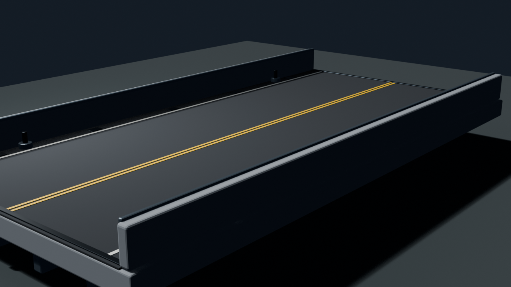
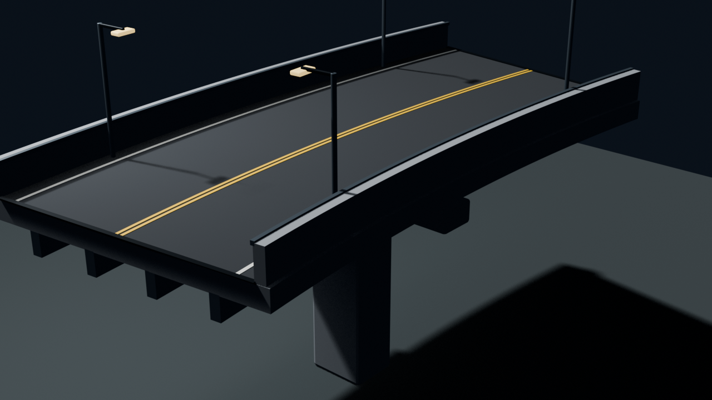

# CityWorld Visual Upgrade

This workstream raises CityWorld's visual quality without treating the
user-supplied map as redistributable project content. The original
`CityWorld.zip` stays unchanged. Project-authored models, editable Blender
sources, conversion metadata, tests, and an overlay builder can be published
only when their own provenance passes the repository content audit. A local
derived terrain package may reference the exact user archive during
development, but it must not be committed or shipped.

## Measured baseline

The pinned local archive is 158,845,395 bytes with SHA-256
`ebeac2f0204f25ca1955f29ca1583b2afa4517a3a848feb1db203814acac2ef3`.
`tools/audit_cityworld_visuals.py` validates ZIP paths, encryption, expanded
sizes, compression ratios, case collisions, and the expected digest before it
reads the terrain and placement metadata. Its JSON has no timestamp or host
path and is byte-deterministic for the same input.

The 2026-07-28 baseline contains:

- 1,411 archive entries, 499 model files, 266 object definitions, 20 material
  scripts, and 618 textures;
- 1,922 active placements using 211 unique placement records;
- 39 bridge/elevated-road, 397 fixture, 31 vegetation, 106 building, and 405
  road placements under the first version of the explicit name classifier;
- 22 bridge, 86 fixture, 16 vegetation, and 93 building model files;
- one unresolved placed object definition, `pantallaQr`, which is content debt
  rather than a renderer failure.

The three authored teleport anchors give two useful staged transport links:

1. Penguinville to NeoQueretaro: 2,067.758 metres.
2. NeoQueretaro to NeoQ2.0: 5,401.543 metres.

The direct Penguinville-to-NeoQ2.0 distance is 7,374.342 metres and is not the
first construction target. A link is a road corridor with bridge or elevated
spans where the terrain requires them, not a single multi-kilometre mesh.

Run the local audit with:

```bash
python3 tools/audit_cityworld_visuals.py \
  "$HOME/Library/Application Support/Rigs of Rods/mods/CityWorld.zip" \
  --expect-sha256 \
  ebeac2f0204f25ca1955f29ca1583b2afa4517a3a848feb1db203814acac2ef3 \
  --pretty --output /tmp/cityworld-visual-audit.json
```

### Local overlay package

`tools/build_cityworld_local_overlay.py` turns the pinned, user-supplied
archive and the checked project modules into one deterministic local test ZIP.
The output must be a new path outside the repository:

```bash
mkdir -p /tmp/ror-cityworld-local
python3 tools/build_cityworld_local_overlay.py \
  --archive "$HOME/Library/Application Support/Rigs of Rods/mods/CityWorld.zip" \
  --repo-root "$PWD" \
  --output /tmp/ror-cityworld-local/CityWorldNextLocalOverlay.zip \
  --surface-offset-m 0.08
```

The builder requires the exact pinned archive hash, audits ZIP paths and
telepoints without extracting the archive, validates all four asset manifests
and checked compiler outputs, and writes through a temporary sibling before an
atomic no-overwrite publish. The ZIP contains a derived terrain descriptor, a
project-owned overlay TOBJ, 32 required runtime resources, and one canonical
report. It
contains no original CityWorld geometry, placement, texture, object, or
archive payload. The descriptor references `CityWorld.otc` and
`CityWorld.tobj`, so the original `CityWorld.zip` must remain installed
separately.

The generated descriptor also declares the direct runtime mount explicitly:

```ini
[ResourceBundles]
Dependency = CityWorld.zip:CityWorld.terrn2:ebeac2f0204f25ca1955f29ca1583b2afa4517a3a848feb1db203814acac2ef3
```

`Dependency` values use an exact
`bundle.zip:terrain.terrn2:<64-lowercase-hex-sha256>` identity. Unhashed,
uppercase, malformed, and mismatched digests fail closed. Each member must be
a non-deleted, root-level terrain entry in a ZIP; partial and path-based
lookups are rejected. Immediately before each read-only mount, RoR streams the
resolved archive through SHA-256 and compares it with the authored digest. A
descriptor may declare at most eight dependencies, each at most 512 bytes and
at most 2,048 bytes in aggregate. Read failures, hash mismatches, missing,
ambiguous, duplicate, self-referential, unsafe, or unsupported dependencies
fail terrain loading before `Terrain::initialize()`.

The named terrain member is a selection anchor, not a recursively loaded
descriptor. Only its containing archive is mounted, so dependencies do not
form transitive chains or cycles. The original terrain archive remains a
separately installed, read-only local source and is appended to the derived
terrain's resource group. The derived overlay location therefore keeps
precedence if both archives contain the same resource name.

The first bounded segment is gateway, transition, three 15-degree curves, and
four 20 m tangent spans. Its 192 m centreline starts at Penguinville at
source Y plus the explicit bounded offset. The initial heading compensates for
the curves so the final tangent points at NeoQueretaro; all eight seams are
exact. Fixed ZIP order, timestamps, permissions, and stored payloads make
repeated builds byte-identical. The embedded report marks redistribution and
shipping false and records source/member hashes, tool and generator hashes,
asset/compile provenance, runtime lights, module transforms, seam errors,
target distance, and covered length.

### Authenticated legacy material compatibility

The original archive remains byte-identical. Runtime compatibility is limited
to reviewed identities and fails closed:

- both the CityWorld ZIP SHA-256 and the individual material-script SHA-256
  must match before an in-memory edit is allowed;
- the opened OGRE script stream is byte-compared with the corresponding member
  of the authenticated package, avoiding basename or resource-group guesses;
- mesh requests follow OGRE's exact-case-before-case-insensitive archive
  precedence and are opened from the selected SHA-256-authenticated ZIP before
  a reviewed material alias or fallback can be applied;
- material aliases require the target to have been defined by the same
  authenticated archive SHA, and generated material fallbacks use stable names;
- procedural texture data is limited to seven exact archive-, script-, and
  directive-bound `.dds` replacements with collision-resistant generated
  resource names. Once authorized, those names are always served from the
  in-memory procedural payload and never delegated to a later resource
  location; stale or changed authorization aborts the load. The missing
  `parabusimagenlateral.jpg` reference is repaired into a texture-free lit
  pass so a JPEG request can never receive DDS bytes;
- the compatibility path performs no fuzzy matching, disk rewrite, or global
  diagnostic suppression.

The current macOS arm64 runtime gate applies exact edit counts of 1, 1, 2, 4,
2, 30, and 5 to seven reviewed scripts, for 45 edits total. It then resolves
23 reviewed aliases, creates 11 reviewed lit fallbacks, loads the one generated
4x4 DDS resource demanded by this terrain path, and uses GL3Plus RTSS programs.
The local overlay reaches `TERRAIN LOADING DONE` with zero CityWorld script
errors, zero missing-material warnings in its authenticated resource group, no
request for the absent JPEG, and a clean OGRE shutdown. Two pre-existing
missing-material warnings remain in the unrelated `MeshesRG` group. Native
Linux and Windows runtime confirmation is still required before this becomes a
shared cross-platform acceptance gate.

## Delivery order

### CW0 — Stable light and capture baseline

Complete. An unavailable saved Caelum selection now resolves to the
dependency-free sky, directional sun, ambient light, and fog path. The signed
arm64 rolling app loads CityWorld, captures after 120 warmup frames, and exits
cleanly after 180 frames. The visual capture deliberately leaves content
diagnostics visible.

### CW1 — Original fixture kit

Author a compact, project-owned kit before changing placement density:

- one modular LED streetlight with emissive lens, pole, base, and simplified
  collision;
- one traffic-signal family with shared pole and signal-head materials;
- one bus shelter, bench, bollard, hydrant, and wayfinding-sign family;
- day, dusk, and night material variants without embedded runtime scripts.

The existing map has 71 `parabusQr`, 39 `fancytrafficlight5`, 31
`fancytrafficlight`, and 26 `busstopNJT` placements, so replacements for those
families have high visual leverage. Until PSSM-compatible local light casting
is implemented, fixtures use physically plausible emissive surfaces and the
directional sun; they must not disable global shadows merely to cast a point
light.

The first bounded local-light slice is attached to the project-owned gateway
block: eight versioned warm point lights share the eight emissive luminaires.
The offline validator rejects unknown types, duplicate identifiers, non-finite
positions or colours, out-of-range colours, unsafe ranges, and more than 32
lights per asset. The compiler records the Blender-to-OGRE transform and emits
stable ODEF point-light records; the runtime logs the created count without
changing the global PSSM shadow configuration.

### CW2 — Intercity corridor and bridge kit

Build the Penguinville-to-NeoQueretaro corridor first. Use short modular pieces
with deterministic placement transforms:

- tangent and curved deck spans, expansion joints, barriers, drains, signs,
  lamp mounts, and underside service detail;
- pier, abutment, retaining-wall, and transition pieces;
- separate simplified continuous collision surfaces with outward normals and
  no intersecting faces;
- LODs and far silhouettes that preserve lane alignment and bridge profile.

The local map already has 20 `elevatedhighway` placements, nine standard
pillars, three wide pillars, two ramps, one curve, and one on-ramp. Those are
compatibility references, not sources for a redistributable replacement. The
new kit uses project-owned names and geometry. The longer
NeoQueretaro-to-NeoQ2.0 corridor starts only after the first link passes
collision, navigation, visual, and performance gates.

The first project-owned tangent module is checked in as
`rorng_city_bridge_span_20m`, and the first curve as
`rorng_city_bridge_curve_left_15deg_20m`. Their Blender 5.2 generators produce:

- an editable, metre-scale Blender source and a 1280x720 authoring preview;
- one standard Y-up glTF 2.0 GLB with applied transforms and no imported
  scripts, shaders, textures, cameras, lights, animation, or extensions;
- LOD0/LOD1/LOD2 render objects at 4,636, 300, and 48 triangles;
- a continuous watertight road collision box and separate watertight left and
  right barrier collision boxes, all with outward winding and non-overlapping
  bounds;
- exact start/end connector metadata, an 8.9 m road width, and two 3.5 m
  lanes; the curve additionally pins a 20 m centreline, 15-degree heading
  change, 76.394372684 m radius, and 19.942933147 m chord;
- an integrated reinforced-concrete pier, hammerhead, bearings, expansion
  joints, four LED fixtures, and an emissive material on the curved span; and
- a canonical asset manifest plus A0 release-gate provenance for the GLB and
  manifest.

`tools/validate_cityworld_asset.py` reads the GLB container and accessors
directly. It checks finite data, required normal/UV/tangent streams, exact PBR
material coverage, LOD ratios, connector continuity, welded collision
manifoldness, winding, connectedness, and artifact hashes. The GLB was
byte-identical across consecutive Blender 5.2 arm64 generations. Blender
sources and rendered previews remain pinned artifacts rather than
cross-version byte-canonical formats.





These are the first CW2 modules, not completion of the intercity corridor.
The checked connector solver now assembles three curves, the 12 m transition,
and the 40 m gateway with exact position/tangent continuity. The installed
macOS arm64 app physically drove the DAF through all five modules over
137.569 m with 1.43999 m maximum path error. The building-canyon capture proves
the truck, façades, windows, trees, fixtures, emissive lenses, and all eight
dynamic point lights render together. Full retaining-wall families,
rights-cleared map-overlay placement, Windows/Linux physical execution, the
remaining production camera anchors, and declared frame-time gates are still
required.

The gateway's bounded v2 art pass raises close-range depth without changing
that runtime contract. Its four façades now include exterior window frames,
storefront doors and mullions, balconies, pilasters, bands, parapets, and
stepped rooftop penthouses. The eight deterministic tree instances use three
shape variants, tapered trunk sections, radial branches, and varied lobed
canopies instead of stacked cylinders. LOD0/LOD1/LOD2 contain 32,092, 3,596,
and 276 triangles: 53.5% of the declared close-detail ceiling, then 11.2% and
0.86% of LOD0. The three collision meshes, exact connectors, and eight point
lights remain unchanged. A balanced preview-only fill makes the branch and
street-level depth legible without changing runtime PSSM. No external geometry
or textures are used, and this is a reproducible CityWorld milestone rather
than a claim of AirSim parity.

The Blender 5.2 exporter can share accessors and vary same-material component
order, so the v2 generator closes that authoring nondeterminism before hashing
the GLB. It rebuilds independent accessors per primitive, retains a one-to-one
mapping for every referenced vertex, preserves raw positions and accessor
bounds, and only cyclically rotates triangles before stable sorting, which
preserves winding. Two consecutive full generations produced byte-identical
GLB output; the asset validator then rechecked LOD budgets, render attributes,
collision manifoldness/winding, connectors, materials, and runtime lights.

Both spans pass the production offline scene-compiler boundary. Each checked
runtime package contains three OGRE render LOD meshes, three separate collision
meshes, an ODEF, deterministic material fallback, and a canonical conversion
report. The curve's LED lens is carried through core glTF `emissiveFactor` into
the generated OGRE `emissive` pass. The compiler pins OGRE 14.5.2, little-endian
`MeshSerializer_v1.100`, stable submesh/material identifiers, explicit
80 m/180 m manual LOD distances, and the tested Blender-to-glTF-to-OGRE basis.
Cross-platform CI regenerates and hashes the deterministic XML lowering,
validates the checked binary/package records without executing a host converter,
and fails on stale or unknown files. See
[CityWorld Next offline scene compiler](CITYWORLD_SCENE_COMPILER.md).

### CW3 — Vegetation

Replace the repeated billboard-era trees with a small bioclimatically coherent
library. Each species has:

- a wind-ready trunk/canopy hierarchy and authored normals;
- at least three deterministic shape variants;
- close, medium, far, and impostor LODs with stable silhouettes;
- alpha-tested foliage with mip-safe edge treatment;
- a trunk-only or capsule-like collision proxy where vehicle contact matters;
- seasonal/tint variation driven by instance data rather than copied textures.

The first replacement target is the 18 individually placed `arbol1Qr` objects,
followed by the larger grouped tree meshes. Vegetation instancing and temporal
stability must be measured before placement density rises.

### CW4 — Buildings

Start with one low-rise modular facade set and one skyline landmark set. Preserve
real scale, door/window rhythm, roof silhouettes, and street-level parallax.
Every building provides:

- reusable facade modules and trim instead of one giant baked texture;
- albedo, normal, occlusion/roughness/metalness, and emissive source maps;
- authored tangents, weighted normals, and at least three LODs;
- simple, continuous collision geometry distinct from the render mesh;
- optional interiors only for approved, bounded entry zones.

The first high-reuse targets are the store and townhouse families. High-rise
and skyscraper replacements follow once the material pipeline can render their
glass, metal, emissive windows, and reflections consistently.

## Blender and interchange contract

Blender is an authoring tool, not a runtime dependency. The Blender MCP may
create and inspect assets when connected, but all outputs must be reproducible
headlessly from checked-in scripts and manifests.

- Author in metres and apply location, rotation, and scale before export.
- Keep render, collision, and each LOD as separate named objects.
- Use stable lowercase ASCII asset identifiers prefixed with `rorng_city_`.
- Preserve the editable `.blend` source and export glTF 2.0 as the neutral
  interchange artifact. The offline scene compiler owns glTF validation,
  coordinate conversion, texture transcoding, OGRE mesh generation, material
  fallback generation, and canonical hashes.
- RoR is Y-up while Blender is Z-up. The legacy OGRE export path requires the
  documented `xz-y` axis swap; the offline compiler must encode and test the
  equivalent transform rather than relying on an artist checkbox.
- Never import executable scripts or third-party shaders from a scene package.
- Record Blender version, generator revision, source hash, export settings,
  compiler revision, output hashes, author, license, and redistribution
  evidence for every asset.

The current compiler profile intentionally requires every object transform to
be applied and rejects hierarchy, extensions, animation, morph targets, unknown
attributes, malformed accessors, and any unowned output. The glTF export already
performs Blender's `(x, y, z) -> (x, z, -y)` rotation; glTF and OGRE are both
Y-up, so the compiler asserts an identity interchange-to-runtime transform
instead of applying the axis swap twice.

The current official Blender mesh guide is written around Blender 2.79 and
points newer Blender users to `blender2ogre`; this project instead treats glTF
as the stable source interchange and OGRE mesh as a compiled runtime artifact.
That keeps authoring modern and prevents platform-specific Blender add-ons from
becoming part of the game runtime.

## Initial budgets and gates

Budgets are per authored asset family and are tightened from measured captures;
they are not permission to spend the entire budget on every instance.

| Asset | LOD0 triangle ceiling | Required reduction |
| --- | ---: | --- |
| Street fixture | 12,000 | LOD1 <= 35%, LOD2 <= 10% |
| Hero tree | 35,000 | LOD1 <= 40%, LOD2 <= 12%, impostor |
| Modular low-rise | 80,000 | LOD1 <= 35%, LOD2 <= 10% |
| Landmark building | 180,000 | LOD1 <= 30%, LOD2 <= 8% |
| 20 m bridge span | 60,000 | LOD1 <= 35%, LOD2 <= 10% |

No CityWorld visual milestone is complete until:

- the original archive remains byte-identical and the local overlay is
  reproducible from a pinned manifest;
- every new asset passes provenance, glTF validation, finite-transform,
  material-completeness, texture-colour-space, tangent, LOD, and collision
  checks;
- no white, pink, or black missing-material fallback is visible and the log has
  no new missing-material, renderer API, or shader diagnostic;
- bridge lanes are continuous, collision proxies do not snag or tunnel a
  vehicle, and all intended clearance envelopes pass;
- fixed cameras at each city anchor, both corridor approaches, a bridge deck,
  a tree-lined street, and a building canyon pass perceptual and temporal
  regression gates;
- the macOS arm64 high preset sustains 60 FPS at 1920x1080 with p95 frame time
  at or below 18.3 ms on the declared reference machine, followed by native
  Windows and Linux validation before the feature becomes a shared default.

Hardware ray tracing remains optional backend work after this raster baseline.
The portable fidelity path is dynamic sun/ambient lighting, PSSM shadows,
HDR/PBR materials, reflection probes, instancing, LODs, atmosphere, and
post-processing. Metal, DirectX 12, and Vulkan ray-tracing implementations may
later accelerate selected shadows/reflections, but CityWorld content must not
depend on one platform's ray-tracing API.

## References

- [RoR Blender mesh editing](https://docs.rigsofrods.org/tools-tutorials/blender-mesh-editing/)
- [RoR terrain object placement](https://docs.rigsofrods.org/terrain-creation/editing-terrain-objects/)
- [RoR collision meshes](https://docs.rigsofrods.org/terrain-creation/collision-meshes/)
- [RoR object definitions](https://docs.rigsofrods.org/terrain-creation/object-format/)
- [Blender glTF 2.0 exporter](https://docs.blender.org/manual/en/3.3/addons/import_export/scene_gltf2.html)
